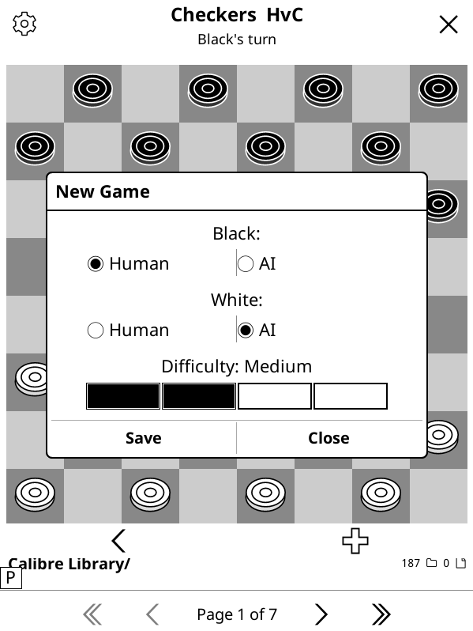

# Checkers for KOReader

English draughts (checkers) plugin for [KOReader](https://koreader.rocks). Play human vs human or against a built-in AI opponent.

## Features

- **Standard English draughts rules** — forced captures, multi-jump, king promotion, 40-move draw rule
- **AI opponent** — alpha-beta search with four difficulty levels (Easy / Medium / Hard / Expert)
- **Flexible modes** — each side (Black, White) can independently be Human or AI
- **Undo** — steps back over the AI's reply so you always return to your own turn
- **Persistent settings** — mode and difficulty are remembered between sessions

## Installation

1. Download the release or clone this repository as a folder named `checkers.koplugin`.
2. Copy the folder into `/koreader/plugins` directory on your device
3. Restart KOReader (or reload plugins via **Settings → Plugin settings → Reload plugins**).

The plugin will appear under **Tools → Checkers** in the KOReader menu.

> Icons are automatically installed to `~/.config/koreader/icons/checkers/` on the first run.

## Usage

### Starting a game

Open **Tools → Checkers** to open the New Game dialog. Choose which side each player is (Human or AI) and the difficulty, then tap **Save**. The game starts immediately.

You can reopen the settings at any time using the **⚙ gear icon** in the top-left corner of the board.

### Playing

- **Tap a piece** to select it — valid destination squares are shown as dots.
- **Tap a destination** to move. If a capture is available, it is forced (the dots only show legal moves).
- When a multi-jump is possible after a capture, the piece stays selected and you must continue jumping.

### Toolbar buttons

| Button | Action |
|--------|--------|
| **‹** (bottom-left) | Undo — steps back over the AI's reply |
| **+** (bottom-right) | New game (asks for confirmation) |
| **⚙** (top-left) | Open settings / change mode or difficulty |
| **✕** (top-right) | Exit Checkers |

### Difficulty levels

| Level  | Search depth | Notes |
|--------|-------------|-------|
| Easy   | 3 | Misses short-term threats |
| Medium | 5 | Plays solid, misses some tactics |
| Hard   | 7 | Strong club-level play |
| Expert | 9 | May think for several seconds per move |

## Rules summary (English draughts)

- Black moves first (down the board), White moves up.
- Pieces move diagonally forward one square.
- Captures jump over an adjacent enemy to the empty square beyond; captures are **forced**.
- A chain of captures in one turn is a **multi-jump** — you must continue as long as captures are available.
- A piece reaching the far rank is **crowned king** and may move or capture in any diagonal direction.
- The game ends when a player has no legal moves, or after **40 consecutive moves without a capture** (draw).

## Acknowledgements

The rule book is based on the [checkers](https://github.com/ImparaAI/checkers) python library.

The AI is based on *njmarko*'s [alpha-beta-pruning-minmax-checkers](https://github.com/njmarko/alpha-beta-pruning-minmax-checkers) engine

## License

This program is free software: you can redistribute it and/or modify it under the terms of the GNU General Public License as published by the Free Software Foundation, either version 3 of the License, or (at your option) any later version. This program is distributed in the hope that it will be useful, but WITHOUT ANY WARRANTY; without even the implied warranty of MERCHANTABILITY or FITNESS FOR A PARTICULAR PURPOSE. See the GNU General Public License for more details. You should have received a copy of the GNU General Public License along with this program. If not, see http://www.gnu.org/licenses/.
